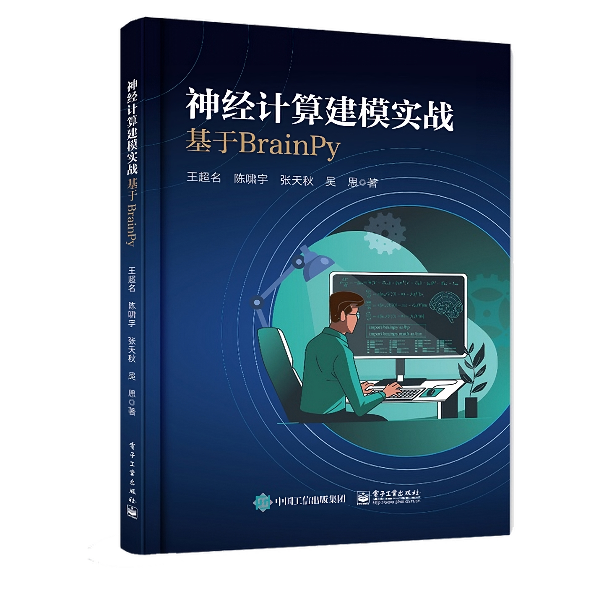

# 神经计算建模实战: 基于BrainPy

- [京东购买链接](https://item.jd.com/14017250.html)

## 内容简介

计算神经科学作为脑科学与人工智能之间的桥梁，是一门高速发展的新兴交叉学科。本书采用理论与实践结合的方式为读者讲述计算神经科学的基础知识。它从基础的数学和物理原理出发，详细介绍了各类神经元模型、突触模型，以及具有不同结构和功能的网络模型，如兴奋―抑制平衡网络、决策网络、连续吸引子网络、库网络等。本书不仅讲解了理论知识，还基于BrainPy（专门针对计算神经科学设计的编程框架）提供了实践代码，使读者能够动手模拟和分析神经系统的行为和性质。本书既可以作为计算神经科学的教材，也可以作为对该领域感兴趣的读者的参考书。

## 作者简介

**王超名**，北京大学心理与认知科学学院博雅博士后。于2018年获得北京交通大学工学学士学位，2023年获得北京大学理学博士学位。研究领域是计算认知神经科学与大规模脑仿真。通用脑动力学编程框架BrainPy的发起人与主理人。

**陈啸宇**，加拿大多伦多大学生理系博士研究生。于2021年获得清华大学理学学士学位，曾于北京大学神经信息处理实验室担任科研助理。研究领域是神经生物学和计算认知神经科学。

**张天秋**，北京大学前沿交叉学科研究院博士研究生。于2022年获得北京邮电大学工学学士学位。研究领域是计算认知神经科学与大规模脑仿真。

**吴思**，北京大学心理与认知科学学院教授，IDG麦戈文脑科学研究所、定量生物学中心、北京大学―清华大学生命科学联合中心研究员，北京智源学者。研究领域是计算认知神经科学和类脑计算。

## 精彩书评

> "Hands-on experience with mathematical models of neurons and neural networks is an excellent way to learn
> computational neuroscience. This book provides an in-depth guide for it."
>
> —— 汪小京 纽约大学神经科学教授，纽约大学斯沃茨理论神经科学中心联合主任

> "
>
结构仿脑，功能类脑，性能超脑，这是类脑计算的基本理念。然而知易行难，如何上手呢？《神经计算建模实战：基于BrainPy》无疑是一场及时雨，本书简明扼要，实战性强，使计算机科学和神经科学的学生都能很容易地快速进入这个令人兴奋的方向，强烈推荐！"
>
> —— 黄铁军 北京大学计算机学院教授，北京智源人工智能研究院院长

> "
>
最近，我们都被以ChatGPT为代表的通用人工智能带来的翻天覆地的变化所震惊。它究竟是如何拥有如此强大的类人智能的？它将如何重塑我们的生活？它是否有极限或终将超越人类？作为脑科学、认知科学与计算机科学的交叉，计算神经科学将最有可能回答上述问题，因为从科学发展史来看，革命性的突破往往来自在多学科的交叉点使用了超越同时代技术的新技术。国内计算神经科学的领军人物吴思教授在本书中不仅系统地介绍了计算神经科学，还提供了能够破解类人智能的黑科技BrainPy。因此，我们会以此为始，开创未来。"
>
> —— 刘嘉 清华大学基础科学讲席教授，脑与智能实验室首席研究员
